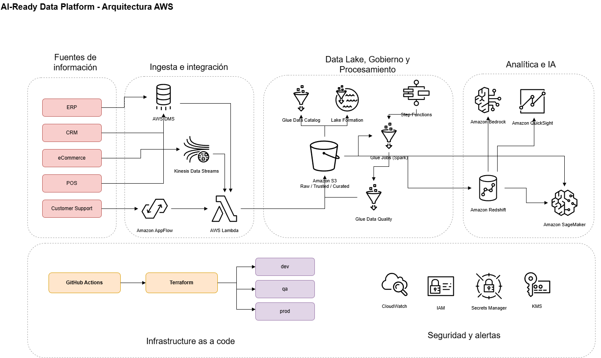

# AI-Ready Data Platform

## Resumen Ejecutivo

Este proyecto consolidó fuentes de datos empresariales que antes operaban de forma independiente (ERP, CRM, eCommerce, POS y soporte) en una plataforma única para analítica e IA. La solución se implementó con arquitectura cloud, pipelines gobernados y enfoque IaC en tres ambientes (`dev`, `qa`, `prod`), permitiendo acelerar decisiones de negocio y mejorar la confiabilidad del dato. El proyecto completo duró 3 años y 7 meses debido a la gran cantidad de iniciativas y fuentes de información que se fueron añadiendo al proyecto. También se hicieron actividades de adopción debido a los cambios de cultura organizacional y entendimiento de como funcionarían los nuevos procesos.

Como resultado de la implementación:
- **Tiempo a insight**: `-45%`
- **Errores de calidad**: `-60%`
- **Casos de IA habilitados**: `+3`

**Nota de seguridad de la información:** este documento describe arquitectura, procesos y resultados de forma referencial; **no publica datos sensibles, personales ni confidenciales**, en cumplimiento de las políticas de seguridad de la información de la organización.

**Nota acerca de los proyectos implementados:**
Cada uno de los proyectos que nosotros implementamos lo hacemos a la medida de cada cliente. Es importante conocer que no todos los proyectos van a la misma velocidad ni duran el mismo tiempo y se debe tener en cuenta el estado actual de los datos de la empresa a trabajar.

## 1) Contexto del proyecto (caso real)

Una empresa del retail operaba sus datos en silos:
- `ERP` (finanzas, inventario y compras)
- `CRM` (clientes y campañas)
- `eCommerce` (órdenes y comportamiento digital)
- `POS` en tiendas físicas
- `Customer Support` (tickets y satisfacción)

Cada área trabajaba con reportes independientes, con definiciones distintas de KPIs y baja trazabilidad. El resultado era alta fricción para análisis y decisiones lentas.

## 2) Objetivo de la implementación

Diseñar e implementar una plataforma de analítica de datos y pipelines que:
- unifique todas las fuentes en una sola base analítica confiable,
- estandarice calidad y gobierno de datos,
- habilite casos de IA sobre información integrada y consistente.

## 3) Arquitectura de datos unificada (servicios cloud)

> Referencia de nube: **AWS** 

### Ingesta e integración
- **AWS DMS**: replicación de bases transaccionales (ERP/CRM/POS) hacia data lake.
- **Amazon AppFlow**: extracción de aplicaciones SaaS.
- **Amazon Kinesis Data Streams**: eventos near real-time (clickstream y eventos de eCommerce).
- **AWS Lambda**: conectores y transformaciones ligeras de ingesta.

### Almacenamiento y gobierno
- **Amazon S3**: data lake (zonas `raw`, `trusted`, `curated`).
- **AWS Glue Data Catalog**: catálogo central de datasets.
- **AWS Lake Formation**: control de acceso por dominio/equipo.

### Procesamiento y calidad
- **AWS Glue Jobs (Spark)**: ETL/ELT y estandarización.
- **AWS Step Functions**: orquestación de pipelines de punta a punta.
- **AWS Glue Data Quality**: reglas de calidad y validaciones automáticas.

### Capa analítica
- **Amazon Redshift**: modelo analítico consolidado (hechos/dimensiones/data marts).
- **Amazon QuickSight**: dashboards ejecutivos y autoservicio BI.

### IA/ML habilitada
- **Amazon SageMaker**: entrenamiento, despliegue y monitoreo de modelos.
- **Amazon Bedrock**: capacidades generativas para casos conversacionales y resumen inteligente.

### Observabilidad y seguridad
- **Amazon CloudWatch**: logs, métricas y alertamiento operativo.
- **AWS IAM** + **AWS KMS** + **AWS Secrets Manager**: identidad, cifrado y gestión de secretos.

## 4) Infrastructure as Code (IaC) con 3 ambientes

La plataforma se gestionó completamente con **Terraform** + **GitHub Actions**, con separación por ambientes:
- `dev`: desarrollo y pruebas funcionales de pipelines.
- `qa`: pruebas de integración, calidad y performance controlada.
- `prod`: operación analítica y cargas oficiales para negocio.

### Diseño IaC
- Módulos reutilizables por dominio (`ingestion`, `processing`, `analytics`, `security`).
- Estado remoto por ambiente en **S3** con locking en **DynamoDB**.
- Variables por entorno (`tfvars`) para tamaños de clúster, ventanas de carga, políticas de retención.
- Pipeline CI/CD con validación, `plan` y `apply` con aprobaciones por promoción de ambiente.

### Flujo de despliegue
1. Commit y PR en rama de feature.
2. `terraform fmt`, `validate`, análisis estático y `plan` automático en `dev`.
3. Aprobación y promoción a `qa` con pruebas de regresión de datos.
4. Aprobación final y despliegue a `prod`.

## 5) Unificación de fuentes para analítica

Se implementó un modelo en capas:
- **Raw**: datos tal como llegan desde cada sistema.
- **Trusted**: limpieza, estandarización de esquemas, deduplicación y reglas de calidad.
- **Curated**: modelos de negocio (ventas 360, cliente 360, inventario, marketing attribution).

Esta estrategia permitió tener una **single source of truth** para analítica, eliminando reportes desconectados y métricas contradictorias.

## 6) Casos de IA habilitados tras la implementación

Tras consolidar datos y asegurar calidad, se habilitaron estos 3 casos de IA:

1. **Predicción de demanda e inventario (Forecasting)**
   - Pronóstico por tienda, categoría y temporalidad.
   - Optimización de reposición para reducir quiebres y sobrestock.

2. **Propensión de compra y churn de clientes**
   - Modelos para priorizar campañas de retención y cross-sell.
   - Segmentación dinámica basada en comportamiento omnicanal.

3. **Copiloto analítico para negocio (GenAI + analytics)**
   - Consultas en lenguaje natural sobre KPIs curados.
   - Resumen automático de variaciones y anomalías por periodo.

## 7) Resultados del proyecto

Indicadores obtenidos después de la implementación:

- **Tiempo a insight**: `-45%`
- **Errores de calidad**: `-60%`
- **Casos de IA habilitados**: `+3`

## 8) Entregables principales

- Plataforma de datos unificada para analítica empresarial.
- Pipelines productivos con gobierno y calidad automatizada.
- Base técnica para escalar iniciativas de IA de forma segura y medible.

